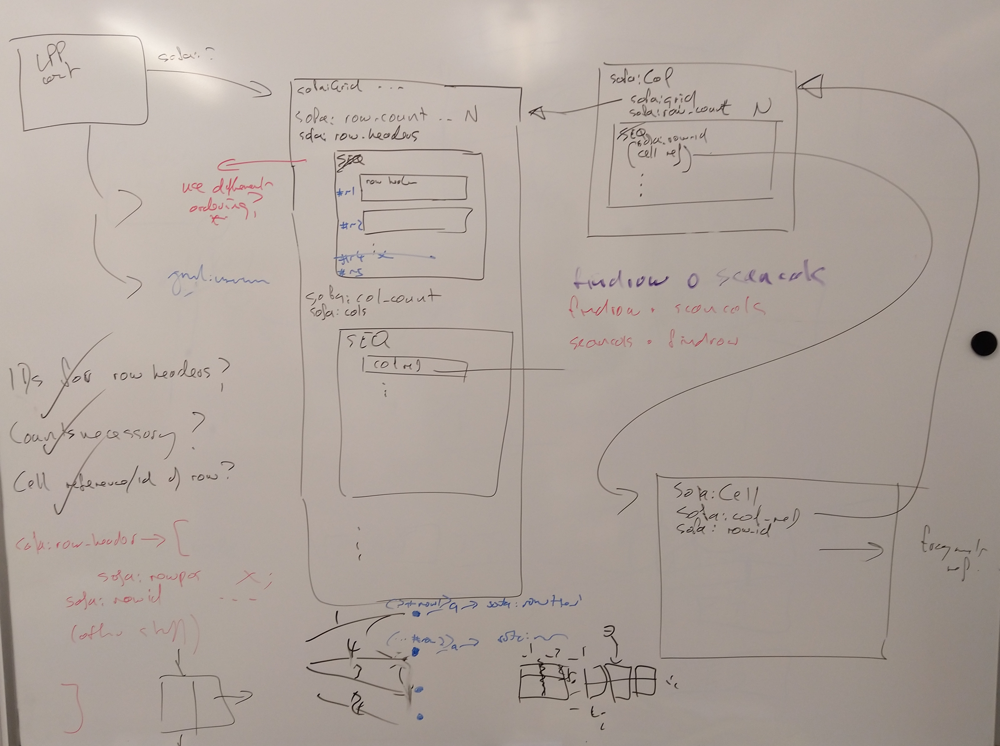

# Session state representation (proposal)

A session state is represented as an LDP container.  Within the container are:

1.  Exactly one "grid" item, which is referenced by a known property in the container metadata.

        <composition-grid-URI> a sofa:Grid ;
            sofa:workingSet <working-set-URI> ;
            sofa:matchServiceIndex <match-service-index-URI> ;
            sofa:row_header     // Repeated property, no inherent ordering
                [ sofa:rowid  <rowid1> ;
                  sofa:rowpos "N1"^^xsd:int ;   // Row position on grid
                  sofa:instrument <instrument-type-URI> ;
                  sofa:pitch_range ... ;
                    :
                  (other composition-row metadata)
                ],
                [ sofa:rowid <rowid2> ;
                  sofa:rowpos "N2"^^xsd:int ;
                  sofa:instrument <instrument-type-URI> ;
                  sofa:pitch_range ... ;
                    :
                ]
                  :
                ;
            sofa:cols     // RDF list...
                ( <col-1-URI>
                  <col-2-URI>
                   :
                ) ;
              :
            (other composition-wide metadata)
              :
            .

2. A number of "column" items, one for each "time-segment" within the composition.

        <composition-col-uri> a sofa:Col ;
            sofa:ref_grid <grid-uri> ;    // Back reference to grid item
            sofa:row 
                [ sofa:rowid <rowid1> ; sofa:ref_cell <cell-1-URI> ],
                [ sofa:rowid <rowid2> ; sofa:ref_cell <cell-2-URI> ],
                  :
                ;
              ) ;
            .

3. A number of "cell" items, referenced from the sofa:Col entities.

        <composition-cell-URI> a sofa:Cell ;
            sofa:col    <col-uri> ;     // Back reference to column item
            sofa:rowid  <rowid> ;       // Back-reference to row id
            sofa:fragment <fragment-description-URI> ;
             :
            (other composition fragment metadata)
             :
            .

    If a fragment has not yet been assigned to a cell, the `sofa:fragment` statement is omitted.

    If a fragment has been assigned, a cell item may in future also contain references to a number of match annotations that were active for the selected cell.  This will allow SOFA to reinstate the active filter selection when the cell is selected after a session reload, or after the active filter selection has been changed.  It will also allow SOFA to re-evaluate fragment compatibility with respect to the selection filters that were active when the fragment was selected.  @@REVIEW THIS

The above items are represented as web resources contained by the session state container, each containing an RDF graph represented in some suitable format for which LDP support is mandatory (e.g, Turtle).

## Access patterns

(This is intended as an analysis of performance constraints, not an algorithmic description of how to actually do the updates.  If the patterns work out OK, it may also provide a basis for a SOFA grid API design.

When grid metadata is updated, the state can be updated by a single PUT operation.

When row metadata is updated, the state can be updated by a single PUT operation.

When col metadata is updated, the state can be updated by a single PUT operation to the grid entity.

When a fragment is assigned in the grid, the state can be updated by:

  1.  a single POST or PUT to create or update a cell entity
  2.  a single PUT operation to the corresponding column entity to reference the cell entity.

When a row is added or deleted, the state can be updated by a single PUT to the grid entity for the row header.  The intent here is that cells will be added to (and maybe removed from) columns as-required (i.e., lazily).  A missing cell reference in the grid is presumed to be unallocated.

When a column is added, the state can be updated by:

  1. a POST operation to create the (initially empty) column entity, and 
  2. a PUT to the grid entity to update the sequence of column references.

When a column is deleted, the state can be updated by:

  1. a small series of DELETE operations for the referenced cell items, 
  2. a DELETE operation for the column item, and 
  3. a PUT to update the grid item description.

@@There was some discussion about whether the selected filter criteria should be saved in the structure.  To some extent, that would be covered by saving active match annotations for each selected fragment.  These considerations might be covered by "other" metadata not explicitly mentioned above.

## NOTES

The design as outlined includes back-references from colmns to the grid, and from cells to columns.  I am assuming these are cheap to add at the point of creation (the necessary information will be available), and that these may help subsequently with navigation (e.g. given a cell reference, being able to find its column).  The column-to-grid reference is superfluous in the current design as one could (presumably) always find the grid entity from the container metadata, but if the cost is trivial it may allow greater design flexibility in future (e.g. multiple grids in a container).

Proper interpretation of column items will require access to the corresponding grid item, so that relevant row header information can be accessed.  The rows in the grid item are definitive.

The column-first representation of the grid means that anticipated common operations are either O(1) or O(_Nrows_) in the number of web accesses required (where _Nrows_ is presumed to be small).  The current design has rows added or removed from the bottom of the grid.  Adding or removing a row in the middle of the grid will require updating each column (or adopting some convention for ignoring deleted rows).

Garbage collection and dynamic structure:  I am assuming that when a column item is deleted, referenced cell items are also deleted.  Thus, each cell item is referenced by exactly one column.  Similarly, when a column item is accessed, if its row count is creater than the grid row count, the surpluse cell items can be deleted and the column item upodated accordingly.  An implementation could choose to automatically extend a column item with "empty" cell references of the grid row count is greater than the column row count.

